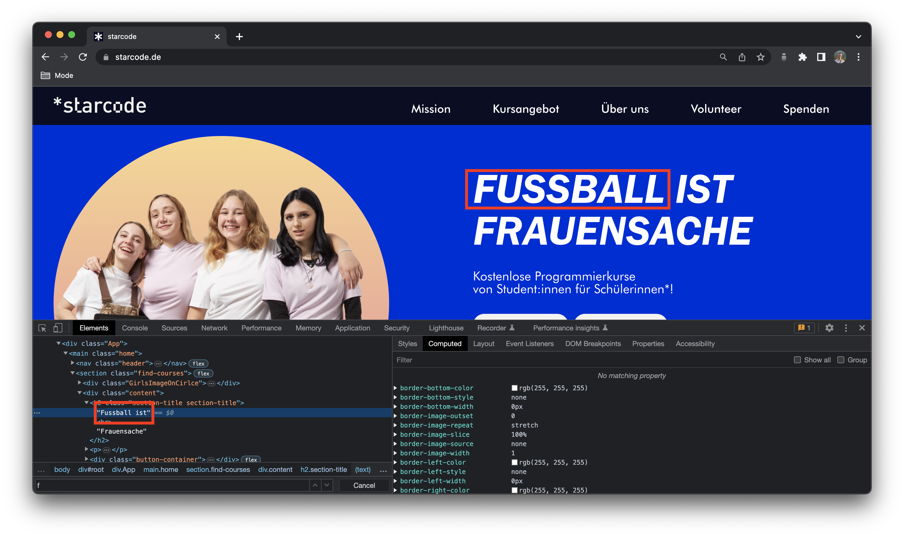
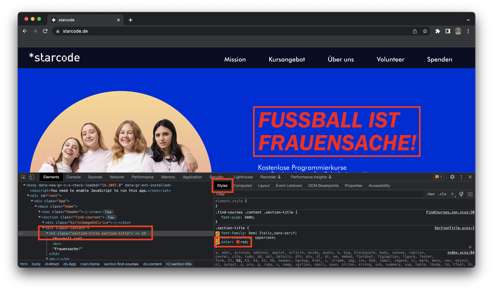

# Aufgabe 1: Websites manipulieren

1. Geht auf eine beliebige Website im Chrome-Browser (z.B. https://www.starcode.de)
2. Klickt mit der rechten Maustaste auf die Website und wählt "Untersuchen"
3. Schaut euch die HTML-Struktur der Website an (Section "Elements")
4. Wählt eine Überschrift aus (mit Doppelklick) und ändert den Text
   
5. Klickt auf das "Styles"-Tab und ändert die Farbe der Überschrift
   
