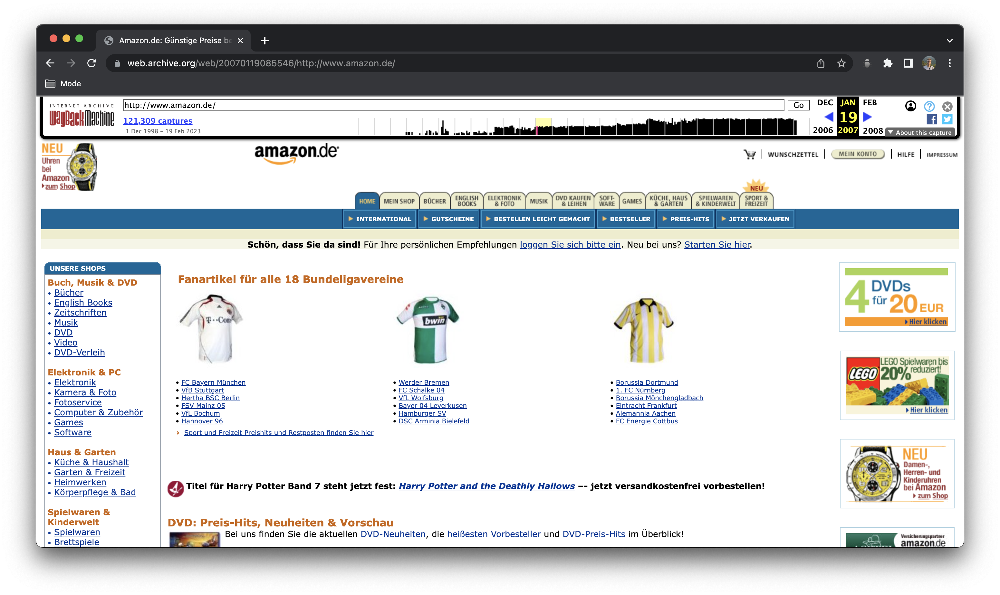

# Aufgabe 2: Websites Zeitmaschine

1. Geht auf https://web.archive.org
2. Sucht nach einer beliebigen Website (z.B. https://www.amazon.de)
3. Klickt oben den Zeitpunkt an, zu dem ihr die Website sehen wollt

Beispiel: Amazon im Jahr 2007

_Bildquelle: [http://web.archive.org/web/20070119085546/http://www.amazon.de/](http://web.archive.org/web/20070119085546/http://www.amazon.de/)_
