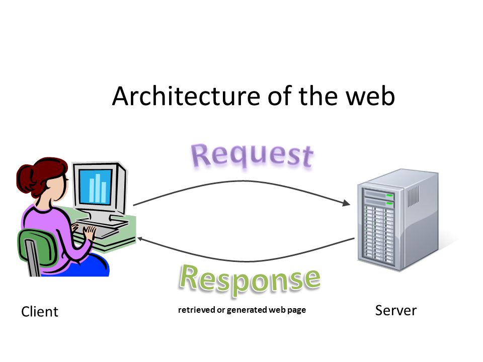

# 1. Einführung in die Webentwicklung

## 1. Was ist Informatik?

Die Informatik ist ein spannendes Feld, das sich mit der Technologie und dem Computer beschäftigt. Es geht darum, wie man Computer benutzt, um Probleme zu lösen und Dinge zu automatisieren. In der heutigen Welt sind Computer allgegenwärtig und haben einen großen Einfluss auf unser tägliches Leben. Sie sind in unseren Handys, Tablets, Laptops, Spielkonsolen und sogar in unseren Autos und Haushaltsgeräten vorhanden.

Wenn du dich für Informatik interessierst, kannst du lernen, wie man Spiele oder Animationen programmieren oder wie man Webseiten erstellt. Du kannst auch lernen, wie man eine Datenbank erstellt oder wie man ein Netzwerk einrichtet. Das Schöne an der Informatik ist, dass es so viele Möglichkeiten gibt und dass du deine eigenen Projekte erstellen und Ideen umsetzen kannst.

Insgesamt ist die Informatik ein tolles Thema, das dir Fähigkeiten vermitteln kann, die du für deine Zukunft brauchen wirst. Wenn du dich für Technologie interessierst und gerne Dinge erforschst und kreierst, dann ist die Informatik das richtige Fach für dich!

## 2. Was ist Webprogrammierung?

Webprogrammierung ist ein spannendes und kreatives Feld, das sich mit der Erstellung von Websites beschäftigt.

In der Webprogrammierung lernen wir, wie man Websites erstellt, die Text, Bilder und Videos enthalten. Wir lernen auch, wie man interaktive Funktionen wie Buttons, Formulare und Animationen hinzufügt.

Ein wichtiger Teil der Webprogrammierung ist die Verwendung von Sprachen wie HTML, CSS und JavaScript.

:::info

- **HTML** wird verwendet, um den Inhalt deiner Website zu strukturieren (wie das Skelett eines Hauses)
- **CSS** um das Aussehen deiner Website zu gestalten und (wie die Farbe und das Design deines Hauses)
- **JavaScript** um interaktive Funktionen hinzuzufügen (wie die Elektrik die das Haus zum Leben erweckt)

:::

Wenn du diese Sprachen beherrschst, könnt ihr am Ende des Kurses eure eigenen Websites erstellen und sogar andere Websites verbessern.

## 3. Webprogrammierung Showcase

Wir schauen uns einige Websites an, die mit HTML, CSS und JavaScript erstellt wurden.

[**Aufgabe 1: Websites manipulieren**](./aufgabe-1-websites-manipulieren.md)

**Wichtig:** Wir verändern die Website nur lokal auf unserem Computer. Sobald wir die Website neu laden, ist alles wieder wie vorher, da wir sie uns neu vom Server laden.

## 4. Geschichte der Webprogrammierung

Wir schauen uns an wie die Webprogrammierung sich entwickelt hat. Früher sahen Websites noch anders aus als heute, wo sie sehr interaktiv und ansprechend sind. Daher wollen wir uns ansehen, wie einige bekannte Websites früher aussahen.

[**Aufgabe 2: Websites Zeitmaschine**](./aufgabe-2-websites-zeitmaschine.md)

## 5. Sneak Peak in HTML und CSS

Jetzt haben wir bereits einiges gesehen, aber wollen endlich mal selber etwas programmieren.

[**Aufgabe 3: Erste Schritte mit HTML und CSS**](./aufgabe-3-erste-schritte.md)

---

## Links

[Codeply](https://codeply.com/) 
[Wayback Machine](https://archive.org/web/)
