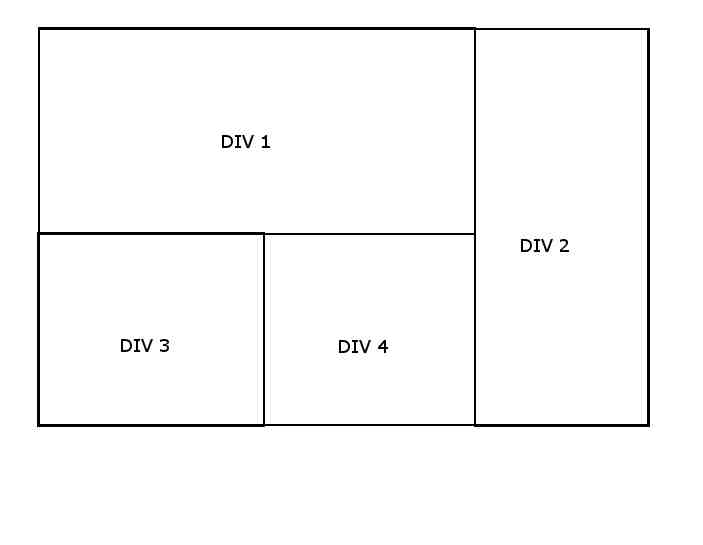
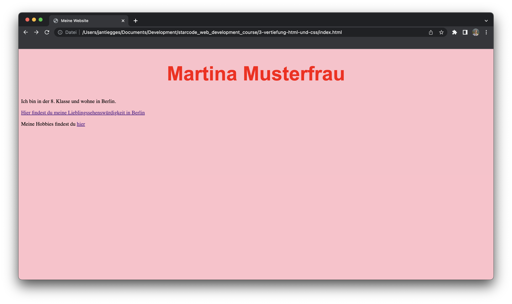
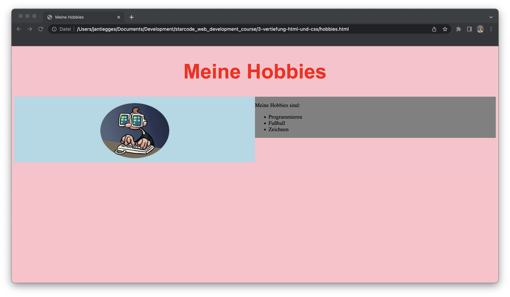

# 3. Vertiefung HTML und CSS

Diese Lektion baut auf den Erkenntnissen aus der Einführung auf. Wir werden uns nun tiefer mit HTML und CSS beschäftigen.

## 1. Listen und Bilder

Zunächst lernen wir zwei weitere wichtige HTML-Elemente kennen:

#### Listen

Mit dem `ul`-Element können wir eine ungeordnete Liste erstellen (also nicht nummeriert). Innerhalb dieses Elements können wir mit dem `li`-Element einzelne Listeneinträge erstellen.

```html
<ul>
  <li>Erster Listeneintrag</li>
  <li>Zweiter Listeneintrag</li>
  <li>Dritter Listeneintrag</li>
</ul>
```

> <ul>
>  <li>Erster Listeneintrag</li>
>  <li>Zweiter Listeneintrag</li>
>  <li>Dritter Listeneintrag</li>
> </ul>

#### Bilder

Mit dem `img`-Element können wir Bilder in unsere Website einfügen. Dieses Element hat ein Attribut namens `src`, welches den Pfad zum Bild angibt. Der Pfad kann dabei auf eine Datei im selben Ordner oder auf eine Datei im Internet verweisen.

```html

```

**Tipp:** Ihr könnt die Bildadresse auch aus dem Browser kopieren, indem ihr mit der rechten Maustaste auf ein Bild klickt und dann auf "Bildadresse kopieren" klickt.

### [Aufgabe 1: Hobbies hinzufügen](./aufgabe-1-hobbies-hinzufügen)

## 2. Anchor Tags

In der letzten Aufgabe habt ihr schon gesehen wie man Bilder auf einer Website verlinken kann. Nun lernen wir ein weiteres wichtiges HTML-Element kennen: den `a`-Tag. Dieser Tag wird verwendet um Links auf einer Website zu erstellen. Der `a`-Tag hat ein Attribut namens `href`, welches den Pfad zum Ziel des Links angibt. Der Pfad kann dabei auf eine Datei im selben Ordner oder auf eine Datei im Internet verweisen.

```html
<a href="https://www.starcode.de">Starcode</a>
```

> <a href="https://www.starcode.de">Starcode</a>

**Tipp:** Ihr könnt die Linkadresse aus dem Browser kopieren, indem ihr oben in die Adresszeile klickt und dann den markierten Text kopiert.

### [Aufgabe 2: Link zur Lieblingssehenswürdigkeit](./aufgabe-2-link-zur-lieblingssehenswürdigkeit)

Nun haben wir gesehen wie wir andere Websiten verlinken können. Moderne Websiten bestehen jedoch oft aus mehreren Seiten. Um zwischen diesen Seiten zu wechseln, müssen wir Links zu den anderen Seiten erstellen. Hierzu verwenden wir als Link nicht wie in der vorherigen Aufgabe den Website-Link, sondern den Pfad zur Datei der anderen Seite.

```html
<a href="zweite-seite.html">Zweite Seite</a>
```

### [Aufgabe 3: Hobbies-Seite erstellen](./aufgabe-3-hobbies-seite-erstellen)

## 3. Div - Container

Divs sind HTML-Elemente, die zur Erstellung von Abschnitten oder Containern auf einer Webseite verwendet werden. Ein Div ist im Wesentlichen ein rechteckiger Kasten, der andere HTML-Elemente wie Text, Bilder oder andere HTML-Tags enthalten kann.

Divs sind ein grundlegender Baustein des modernen Webdesigns und werden häufig verwendet, um Layoutstrukturen zu erstellen und Inhalte auf einer Webseite zu organisieren. Durch die Verwendung von Divs können Webdesigner eine Webseite in kleinere, besser handhabbare Abschnitte unterteilen, die mit CSS (Cascading Style Sheets) individuell gestaltet werden können.



_Bildquelle: [https://i.stack.imgur.com/T7xb7.jpg](https://i.stack.imgur.com/T7xb7.jpg)_

Ihr erstellt divs mit dem `div`-Tag.

```html
<div>
  <p>Text</p>
</div>
```

> <div>
>  <p>Text</p>
> </div>

### [Aufgabe 4: Divs Unterteilung](./aufgabe-4-divs-unterteilung)

## 4. HTML-Attribute & Klassen

HTML-Attribute sind zusätzliche Informationen, die HTML-Elementen hinzugefügt werden können. Sie werden in der Form `name="value"` angegeben und werden innerhalb des Start-Tags eines HTML-Elements angegeben. Ein Beispiel für ein HTML-Attribut welches wir bereits kennen ist das `src`-Attribut. Dieses Attribut wird verwendet, um den Pfad zu einem Bild anzugeben.

Ein wichtiges HTML-Attribut ist das `class`-Attribut. Dieses Attribut wird verwendet, um HTML-Elementen eine Klasse zuzuweisen. HTML-Elemente können mehrere Klassen zugewiesen werden, indem mehrere Klassen mit einem Leerzeichen getrennt angegeben werden.

:::info Klassen
In Programmiersprachen werden Klassen oft verwendet, um Objekte zu Gruppen zusammenzufassen. Ihr könnt euch eine Klasse so vorstellen, als wäre sie eine Art Kategorie, zu der ein Objekt gehört. Ein Beispiel im echten Leben wäre die Klasse "Fahrrad". Alle Fahrräder haben bestimmte Eigenschaften, die sie zu dieser Klasse zählen lassen (z.B. Räder, einen Rahmen, einen Sattel etc.).
:::

HTML-Attribute (wie das `class`-Attribut) werden innerhalb des Start-Tags eines HTML-Elements angegeben.

```html
<div class="fahrrad"></div>
```

### [Aufgabe 5: Klassen hinzufügen](./aufgabe-5-klassen-hinzufügen)

## 5. CSS - Selektoren

In der vorherigen Lektion haben wir bereits kennengelernt, wie man ganze HTML-Elemente (wie z.B. das `<h1>`-Element) in CSS auswählt.

```css
h1 {
  color: red;
}
```

Hiermit ändern wir von allen `h1`-Überschriften die sich auf unserer Website befinden die Farbe in rot. Oft wollen wir aber nur bestimmte Elemente auswählen. Hierzu können wir die Klassen verwenden, die wir in der vorherigen Lektion kennengelernt haben. Wir können Elemente mit einer bestimmten Klasse auswählen, indem wir den Punkt (.) vor den Klassennamen schreiben.

```css
.fahrrad {
  background-color: pink;
}
```

Hiermit ändern wir von allen Elementen mit der Klasse `fahrrad` den Hintergrund in rosa.

### [Aufgabe 6: Klassen stylen](./aufgabe-6-klassen-stylen)

## 6. CSS - Anordnung

Bisher sind alle Elemente auf unserer Website von oben nach unten angeordnet. Mit CSS können wir die Anordnung und die Größe der Elemente verändern, um unsere Seite noch individueller zu gestalten.

#### Float

Mit dem `float`-Attribut können wir Elemente von der normalen Flussrichtung abweichen lassen. Das Element wird dann an der Seite des Elements platziert, das als nächstes kommt. Das Element wird dann nicht mehr von oben nach unten angeordnet, sondern von links nach rechts.

```css
.fahrrad {
  float: left;
}
```


_Bildquelle: [https://miro.medium.com/max/840/1\*CFwJ6lMQMOi4Oy7L8Mn17g.png](https://miro.medium.com/max/840/1*CFwJ6lMQMOi4Oy7L8Mn17g.png)_

#### Width

Mit dem `width`-Attribut können wir die Breite eines Elements bestimmen. Die Breite kann absolut (z.B. 200px) oder relativ (z.B. 50%) angegeben werden.

```css
h1 {
  width: 200px;
}

p {
  width: 50%;
}
```

### [Aufgabe 7: CSS Anordnung](./aufgabe-7-css-anordnung)

## 7. Abschluss

Nun haben wir bereits einiges darüber gelernt, wie wir mit verschiedenen HTML-Elementen eine Website mit Inhalten füllen können und wie wir diese mit CSS gestalten können. In den nächsten Lektionen werden wir noch mehr Möglichkeiten kennenlernen, wie wir unsere Website noch individueller gestalten können.

Am Ende dieser Lektion sollte die Website ungefähr so aussehen:

|           Startseite           |         Hobbies-Seite         |
| :----------------------------: | :---------------------------: |
|  |  |

Die fertigen Dateien für die Aufgaben findest du hier.

Dieser Kurs deckt aber nur einen kleinen Teil der existierenden HTML-Elemente und CSS-Attribute ab. Wenn ihr mehr über HTML und CSS lernen wollt, könnt ihr euch die offizielle Dokumentation von Mozilla anschauen. Hier findet ihr eine Liste aller HTML-Elemente und CSS-Attribute mit einer Beschreibung und Beispielen.

[MDN Web Docs](https://developer.mozilla.org/de/docs/Web)

---

## Links

- [MDN Web Docs HTML](https://developer.mozilla.org/de/docs/Web/HTML)
- [MDN Web Docs CSS](https://developer.mozilla.org/de/docs/Web/CSS)
