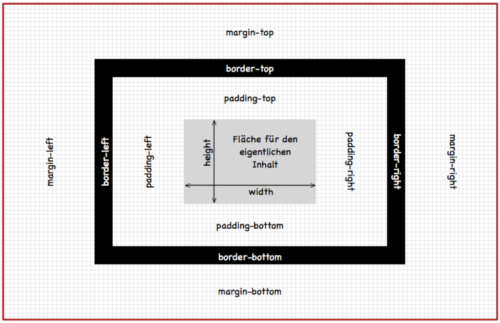

# 5. Vertiefung in Bootstrap 1

In dieser Lektion vertiefen wir unser Wissen über Bootstrap. Wir lernen dabei kennen wie wir mit Margin und Padding arbeiten können, um die Abstände zwischen den Elementen zu verändern. Zudem lernen wir weitere Komponenten kennen mit denen wir unsere Website ausbauen.

## 1. Margin und Padding

Mit Hilfe des Grid-Systems haben wir es schon geschafft unsere App auf verschiedene Bildschirmgrößen anzupassen. Nun wollen wir noch die Abstände zwischen den Elementen anpassen. Hierfür verwenden wir die CSS Eigenschaften `margin` und `padding`.

:::info Margin & Padding

**Padding** ist der Abstand zwischen dem Inhalt eines Elements (wie Text oder ein Bild) und dem Rand des Elements.

**Margin** hingegen ist der Abstand zwischen dem Rand eines Elements und dem nächsten Element.

Um es dir leichter zu merken: Padding ist der Abstand innerhalb eines Elements, während Margin der Abstand zwischen den Elementen ist. Das folgende Schaubild gibt nochmal einen Überblick.



:::

Wenn du zum Beispiel ein Bild auf deiner Website hast, kannst du das Padding ändern, um den Abstand zwischen dem Bild und dem Text, der das Bild umgibt, zu vergrößern oder zu verkleinern. Das Padding wirkt sich auf den Inhalt des Elements aus.

Das Margin hingegen wirkt sich auf den Abstand zwischen den Elementen aus. Wenn du zwei Bilder auf deiner Website hast, kannst du das Margin zwischen ihnen ändern, um den Abstand zu vergrößern oder zu verkleinern.

In CSS fügst du Padding und Margin mit den Eigenschaften `padding` und `margin` hinzu. Du kannst die Eigenschaften mit einem Wert von 0 bis 100% verwenden. Der Wert gibt den Abstand in Prozent des Elementes an.

Der erste Wert gibt dabei den Abstand für links und rechts an, der zweite Wert gibt den Abstand für oben und unten an.

#### Beispiel:

```css
/* Padding */
padding: 10% 5%;
/* Margin */
margin: 10% 5%;
```

In der ersten Aufgabe wollen wir nun Margin und Padding verwenden um unsere Übersicht Section zu gestalten und die Elemente besser zu platzieren.

---

### [🤓 Aufgabe 1: Margin und Padding](aufgabe-1-margin-padding)

---

## 2. CSS Funktionen

In CSS kannst du auch Funktionen verwenden. Diese Funktionen sind sehr nützlich, um bestimmte Eigenschaften zu berechnen. Eine der häufigsten Funktionen ist `rotate()`. Mit dieser Funktion kannst du ein Element drehen, z.B. ein Bild.

Dabei kannst du den Winkel in Grad angeben, um das Element zu drehen. Der positive Winkel dreht das Element im Uhrzeigersinn, während der negative Winkel das Element gegen den Uhrzeigersinn dreht.

#### Beispiel

```css
transform: rotate(15deg);
```

In der nächsten Aufgabe wollen wir nun die Funktion `rotate()` verwenden um das Bild in unserer Übersicht Section zu drehen.

---

### [🤓 Aufgabe 2: Bild drehen](aufgabe-2-bild-drehen)

---

## 2. Feature Section

In dieser Aufgabe wollen wir nun die Feature Section mit Hilfe von Bootstrap erstellen. In der Feature Section wollen wir verschiedene Features unserer App ansprechend darstellen.

Wir benutzen 3 Features in diesem Beispiel, du kannst aber natürlich auch mehr oder weniger Features verwenden. In der ersten Aufgabe wollen wir zunächst das Layout der Feature Section festlegen.

---

### [🤓 Aufgabe 3: Feature Section](aufgabe-3-feature-section)

---

Nachdem wir das Layout der Feature Section festgelegt haben, wollen wir nun die einzelnen Features beschreiben. Hierzu verwenden wir HTML-Elemente für Überschriften und Paragraphen, welche du bereits aus früheren Lektionen kennen solltest.

---

### [🤓 Aufgabe 4: Feature Beschreibungen](aufgabe-4-feature-beschreibung)

---

### Font Awesome Icons

Um die Features noch ansprechender zu gestalten, wollen wir nun noch Icons hinzufügen. Hierfür verwenden wir die Bibliothek Font Awesome. Font Awesome ist eine Bibliothek mit vielen Icons, die du in deiner Website verwenden kannst.

Um die Icons verwenden zu können, musst du zuerst die CSS Datei von Font Awesome in den `<head>` Bereich deiner HTML Datei einfügen. Keine Sorge, dies war bereits in der `index.html` Datei für dich erledigt.

Die Icons kannst du dann mit Hilfe von CSS-Klassen verwenden. Die CSS-Klassen für die Icons findest du auf der [Font Awesome Website](https://fontawesome.com/icons?d=gallery&p=2&m=free). Du kannst die Icons einfach kopieren und in deine HTML Datei einfügen.

Font Awesome bietet dabei nicht nur für die Icons selber Klassen, sondern auch für deren Design.

- Du kannst die Klasse `fas` verwenden, um ein Icon mit Füllung zu erhalten.
- Du kannst die Klasse `fa-4x` verwenden, um das Icon zu vergrößern.
- Du kannst die Klasse `fa-spin` verwenden, um das Icon zu animieren.
- ...

#### Beispiel

```html
<i class="fas fa-4x fa-spin fa-coffee"></i>
```

---

### [🤓 Aufgabe 5: Font Awesome Icons](aufgabe-5-font-awesome-icons)

---

### CSS pseudo-classes

CSS pseudo-classes sind CSS Klassen, die nur für bestimmte Zustände eines Elements gelten. Zum Beispiel kannst du mit CSS pseudo-classes die Aussehen von Elementen verändern, wenn du mit der Maus über sie fährst (englisch: hovern). Hierzu kannst du die CSS pseudo-class `:hover` verwenden.

Du verwendest CSS pseudo-classes, indem du sie nach der CSS Klasse des Elements schreibst. Du kannst CSS pseudo-classes auch mit anderen CSS Klassen kombinieren.

#### Beispiel

```css
.btn:hover {
  background-color: #000;
}
```

In der nächsten Aufgabe wollen wir nun die CSS pseudo-class `:hover` verwenden um die Icons in der Feature Section zu animieren.

---

### [🤓 Aufgabe 6: CSS pseudo-classes](aufgabe-6-css-pseudo-classes)

---

## 4. Abschluss

In dieser Lektion haben wir gelernt wie wir mit Hilfe von Bootstrap und CSS unsere Website gestalten können. Wir haben dabei gelernt wie wir mit Hilfe von Margin und Padding die Abstände zwischen den Elementen anpassen können. Außerdem haben wir gelernt wie wir mit Hilfe von CSS Funktionen Elemente drehen können. Zum Schluss haben wir gelernt wie wir mit Hilfe von Font Awesome Icons und CSS pseudo-classes unsere Website noch ansprechender gestalten können. In der nächsten Lektion lernen wir noch weitere Komponenten von Bootstrap kennen.
