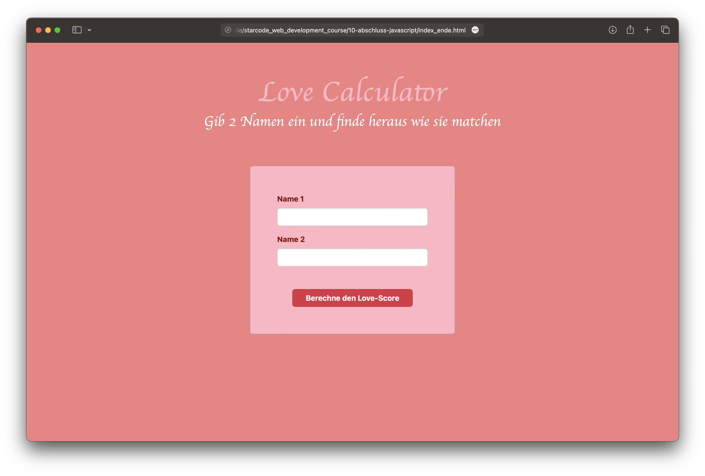

# 8. Einführung in JavaScript

Nachdem wir nun gelernt haben wie wir mit HTML und CSS unsere Websiten gestalten können, wollen wir nun lernen wie wir mit JavaScript unsere Website interaktiv gestalten können.

Tatsächlich hat sich in unserem letzten Projekt schon ein bisschen Javascript eingeschlichen. Einige Bootstrap Komponenten wie z.B. das Carousel oder der Button benötigen JavaScript um zu funktionieren. Wir haben also schon ein bisschen JavaScript geschrieben ohne es zu wissen.

## 1. Was ist JavaScript?

JavaScript ist eine Programmiersprache die es uns ermöglicht unsere Website interaktiv zu gestalten. Wir können damit auf Events wie z.B. Klicks reagieren und unsere Website dynamisch verändern.

JavaScript Dateien haben die Endung `.js` und werden in der HTML Datei mit einem `<script>` Tag eingebunden.

```html
<script src="script.js"></script>
```

Dadurch "weiß" unsere Website dass sie die Datei `script.js` einbinden soll. In dieser Datei können wir nun JavaScript Code schreiben.

## 2. Unser JavaScript Projekt

In den nächsten Lektionen werden wir mit Hilfe von JavaScript eine Love Calculator Website erstellen. Der User kann zwei Namen eingeben und wir berechnen dann wie gut die beiden zusammen passen.

Auf den Bildern unten könnt ihr sehen wie die Website aussehen soll.




Der HTML und CSS Code für die Website ist schon fertig. Wir müssen uns also nur noch um den JavaScript Code kümmern. Damit die Website aber auch euren persönlichen Vorstellungen entspricht, könnt ihr zunächst noch ein paar Änderungen vornehmen

### [🤓 Aufgabe 1: Projekt erstellen](aufgabe-1-js-projekt-erstellen)

## 3. Alerts

Nun wollen wir uns mit den ersten JavaScript Befehlen beschäftigen. Wir wollen einen Alert erstellen, der uns eine Nachricht anzeigt. Ein Alert ist ein kleines Fenster das eine Nachricht anzeigt und den User dazu auffordert auf "OK" zu klicken.

```js
alert("Hello World!");
```

Wenn wir diesen Code in unsere `script.js` Datei schreiben und die Website neu laden, dann sollte ein Alert mit dem Text "Hello World!" erscheinen.

:::tip JavaScript Syntax
JavaScript Befehle werden in der Regel mit einem Semikolon `;` abgeschlossen. Das ist aber nicht zwingend notwendig. Es ist aber wichtig, dass die Befehle in der richtigen Reihenfolge geschrieben werden, da sie in der Reihenfolge ausgeführt werden in der sie geschrieben wurden.
:::

### [🤓 Aufgabe 2: Alert erstellen](aufgabe-2-alert-erstellen)

## 4. Selektoren

Nun haben wir bereits unseren ersten JavaScript Befehl geschrieben. Wir wollen aber noch mehr machen als nur einen Alert zu erstellen, da ein Alert mit einem fixen Text nicht besonders interaktiv ist.

Ein wichtiger Bestandteil von Javascript ist es, auf Inhalte unserer Website zuzugreifen und diese zu verändern. Dafür müssen wir zunächst wissen wie wir auf die Elemente unserer Website zugreifen können. Hierfür gibt es sogenannte Selektoren.

Es gibt verschiedene Arten von Selektoren. Wir werden uns in diesem Kurs aber nur mit einer Form des Selektors beschäftigen. Diese Form ist der Query Selektor.

### Query Selektor

Mit dem Query Selektor können wir auf ein Element zugreifen, indem wir einen CSS Selektor angeben. Wir kennen bereits zwei Selektoren, die wir in den letzten Lektionen verwendet haben. Das sind der Klassen-Selektor und der ID-Selektor.

#### Klassen-Selektor

```css
.meine-überschrift {
  color: red;
}
```

#### ID-Selektor

```css
#meine-überschrift {
  color: red;
}
```

Genau diese Selektoren können wir auch in JavaScript verwenden. Vorher müssen wir aber noch unseren Query-Selektor schreiben. Hierzu nutzen wir den Befehl `document.querySelector()`. In die runden Klammern schreiben wir dann den CSS Selektor.

```js
alert(document.querySelector(".überschrift").innerText);
```

Mit diesem Befehl können wir auf das Element mit der Klasse `überschrift` zugreifen. Wir können nun auf die Eigenschaften des Elements zugreifen. In unserem Fall wollen wir auf den Text des Elements zugreifen. Diesen können wir mit der Eigenschaft `innerText` abrufen.

:::tip JavaScript Objekte
`document.querySelector()` gibt uns ein sogenanntes JavaScript Objekt zurück. Ein Objekt ist eine Sammlung von Eigenschaften und Methoden. Wir können auf die Eigenschaften und Methoden eines Objekts zugreifen, indem wir den Namen des Objekts gefolgt von einem Punkt `.` schreiben und dann den Namen der Eigenschaft oder Methode. In unserem Fall ist die Eigenschaft die wir abrufen wollen der Text des Elements. Die Eigenschaft heißt `innerText`. Wir können also auf den Text des Elements zugreifen indem wir `document.querySelector(".meine-überschrift").innerText` schreiben.
:::

### [🤓 Aufgabe 3: Selektor erstellen](aufgabe-3-selektor-erstellen)

## 5. Event Listener

Nun können wir auf die Elemente unserer Website zugreifen. Wir wollen aber auch auf Events wie z.B. Klicks reagieren. Hierfür gibt es sogenannte Event Listener. Mit einem Event Listener können wir auf ein Event warten und dann wenn das Event eintritt etwas ausführen.

:::tip Events
Events sind Aktionen die der User auf unserer Website ausführt. Das kann z.B. ein Klick auf einen Button sein oder das Scrollen auf der Website.
:::

Wir wollen nun einen Event Listener erstellen, der auf einen Klick auf den Button wartet und dann einen Alert erstellt.

```js
document.querySelector(".button").addEventListener("click", function () {
  alert("Button wurde geklickt!");
});
```

Ihr seht, dass wir hier wieder den Query Selektor verwenden um auf das Element mit der Klasse `button` zuzugreifen. Anschließend verwenden wir den Befehl `addEventListener()`. In die runden Klammern schreiben wir zunächst den Namen des Events auf den wir warten wollen. In unserem Fall ist das der Klick auf den Button. Anschließend schreiben wir was ausgeführt werden soll, wenn das Event eintritt. Hierzu schreiben wir den Befehl `function () {}`. In die geschweiften Klammern schreiben wir dann den Code der ausgeführt werden soll. In unserem Fall erstellen wir einen Alert mit dem Text "Button wurde geklickt!".

### [🤓 Aufgabe 4: Event Listener erstellen](aufgabe-4-event-listener-erstellen)

## 6. Variablen

Nun können wir auf die Elemente unserer Website zugreifen und auf Events reagieren. Wir wollen aber noch mehr machen. Wir wollen z.B. den Text aus einem Input Feld auslesen und dann in einem Alert anzeigen. Hierfür müssen wir zunächst wissen was Variablen sind.

:::tip Variablen

Variablen sind ein zentrales Konzept in der Programmierung. Eine Variable ist ein Behälter für einen Wert. Wir können einen Wert in einer Variable speichern und dann später auf diesen Wert zugreifen.

Stellt euch eine Variable wie eine Schublade vor. In der Schublade können wir einen Wert speichern. Wir können den Wert dann später wieder aus der Schublade holen.

:::

### Wofür brauchen wir Variablen?

Wir brauchen Variablen um Werte zu speichern. Hierbei kann es sich um Texte, Zahlen oder auch andere Dinge handeln. Wir können dann später auf die Werte zugreifen und diese verändern.

Zum Beispiel haben wir ja auf unserer Website zwei Input Felder. In diesen Feldern können wir Text eingeben (die Namen). Um auf den Text zugreifen zu können, können wir diesen in einer Variable speichern. Dann können wir die Namen, welche in der Variable gespeichert sind, später wieder verwenden um den Love Score zu berechnen.

### Variablen erstellen

Um eine Variable zu erstellen müssen wir zunächst den Namen der Variable festlegen. Der Name der Variable darf nur aus Buchstaben, Zahlen, Unterstrichen `_` und Dollarzeichen `$` bestehen. Der Name darf nicht mit einer Zahl beginnen. Der Name darf auch nicht mit einem Unterstrich `_` oder Dollarzeichen `$` beginnen. Der Name darf auch keine Leerzeichen enthalten.

Wir lernen in diesem Kurs zwei Arten von Variablen kennen. Die `let` Variablen und die `const` Variablen. `Let` Variablen können ihren Wert ändern, das heißt wir können später einen anderen Wert in die Variable speichern. `Const` Variablen können ihren Wert nicht ändern, das heißt wir können später keinen anderen Wert in die Variable speichern.

:::tip Variablen Typen
**let** Variablen können ihren Wert ändern.

**const** Variablen können ihren Wert nicht ändern.
:::

Um eine Variable zu erstellen schreiben wir zunächst den Namen der Variable. Anschließend schreiben wir ein Gleichheitszeichen `=` und dann den Wert den wir in der Variable speichern wollen. Wir können dann später auf den Wert der Variable zugreifen indem wir den Namen der Variable schreiben.

```js
const name = "Max";
let alter = 20;
```

In diesem Beispiel erstellen wir zwei Variablen. Die erste Variable hat den Namen `name` und den Wert `"Max"`. Hierfür haben wir eine `const`-Variable verwendet, da sich der Name nicht ändern soll. Die zweite Variable hat den Namen `alter` und den Wert `20`. Hierfür haben wir eine `let`-Variable verwendet, da sich das Alter ändern kann.

### Variablen verwenden

Um auf den Wert einer Variable zuzugreifen schreiben wir einfach den Namen der Variable. Wir können den Wert der Variable auch verändern indem wir den Namen der Variable gefolgt von einem Gleichheitszeichen `=` und dann den neuen Wert schreiben.

```js
const name = "Max";
let alter = 20;
alter = 21;
```

In diesem Beispiel haben wir zunächst eine Variable mit dem Namen `name` und dem Wert `"Max"` erstellt. Anschließend haben wir eine Variable mit dem Namen `alter` und dem Wert `20` erstellt. Anschließend haben wir den Wert der Variable `alter` auf `21` geändert.

In der letzten Aufgabe wollen wir nun alle Dinge die ihr in dieser Lektion gelernt habt zusammenbringen. Wir wollen die Namen aus den Input Feldern auslesen und in einer Variable speichern. Anschließend wollen wir die Namen und den Love Score in einem Alert anzeigen.

### [🤓 Aufgabe 5: Variablen erstellen](aufgabe-5-variablen-erstellen)

## 7. Ausblick

Herzlichen Glückwunsch, du hast nun die ersten Grundlagen von Javascript gelernt. Du kannst nun auf Elemente deiner Website zugreifen, auf Events reagieren und Variablen erstellen. In den nächsten Lektionen werden wir noch mehr über Javascript lernen und weiter an dem Love Calculator arbeiten.
